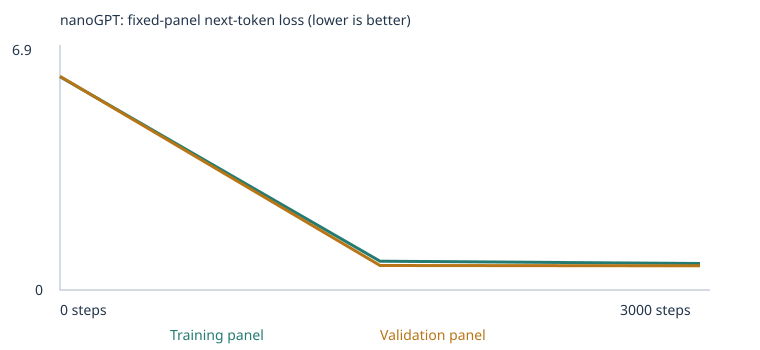

# Class 4: guided nanoGPT experiments

Two fresh CPU experiments completed 3,000 steps each. The starter scored **20/48** after training; the expanded corpus scored **26/48**. Coverage rose from **24/48 to 27/48 scorable cases**, while some correct four-choice answers still produced incoherent unrestricted text. These are results on a **public development benchmark**, not an unseen test of general language ability.

[Starter executed notebook](notebooks/starter.executed.ipynb) · [Expanded executed notebook](notebooks/expanded.executed.ipynb) · [Acceptance evidence](evidence/acceptance.json) · [All 192 case results and continuations](evidence/evaluation_review.md) · [Chat screenshot](evidence/expanded/terminal_chat.png)

## Four experiment/stage results

| Experiment | Stage | All-case success | Scorable accuracy | Case coverage | Complete results |
| --- | --- | --- | --- | --- | --- |
| starter | untrained | 9/48 (18.75%) | 9/24 (37.50%) | 24/48 (50.00%) | [JSON](llm_runs/20260922T235726_929057Z/language_evals/untrained/eval_results.json) / [CSV](llm_runs/20260922T235726_929057Z/language_evals/untrained/eval_results.csv) / [summary](llm_runs/20260922T235726_929057Z/language_evals/untrained/eval_summary.json) |
| starter | final | 20/48 (41.67%) | 20/24 (83.33%) | 24/48 (50.00%) | [JSON](llm_runs/20260922T235726_929057Z/language_evals/final/eval_results.json) / [CSV](llm_runs/20260922T235726_929057Z/language_evals/final/eval_results.csv) / [summary](llm_runs/20260922T235726_929057Z/language_evals/final/eval_summary.json) |
| expanded | untrained | 7/48 (14.58%) | 7/27 (25.93%) | 27/48 (56.25%) | [JSON](llm_runs/20260922T235754_788488Z/language_evals/untrained/eval_results.json) / [CSV](llm_runs/20260922T235754_788488Z/language_evals/untrained/eval_results.csv) / [summary](llm_runs/20260922T235754_788488Z/language_evals/untrained/eval_summary.json) |
| expanded | final | 26/48 (54.17%) | 26/27 (96.30%) | 27/48 (56.25%) | [JSON](llm_runs/20260922T235754_788488Z/language_evals/final/eval_results.json) / [CSV](llm_runs/20260922T235754_788488Z/language_evals/final/eval_results.csv) / [summary](llm_runs/20260922T235754_788488Z/language_evals/final/eval_summary.json) |

**How scoring works.** Only each prompt enters the network. The unchanged scorer takes the highest-probability word among four single-token choices; those probabilities come from the full vocabulary softmax and are not renormalized over the choices. The answer key is applied afterward. A tie earns zero. Any unknown prompt word or unknown choice makes a case unscorable; it still counts as zero in all-case success. Four choices suggest a 25% random baseline only for fully scorable cases, not a promised untrained score and not 25% of all 48 when coverage is incomplete.

**What the other measurements mean.** Scorable accuracy divides correct answers by scorable cases. Case coverage asks whether every required word and the context length are supported. Token unknown rates count individual token occurrences and use different denominators. Free continuations sample from the whole vocabulary at temperature 0.8, seed 2026 + case index, maximum 24 new tokens; they are saved for review and do not determine the four-choice score. EOS can produce an empty reply. BOS is blocked by the supplied eval/chat generator, but the supplied BOS sample generator is unchanged.

## Prediction and design

The [prediction was recorded before any training](evidence/provenance/PREDICTION.md): “Training loss should fall and samples should resemble the corpus more closely. Validation loss may improve. Added examples may improve vocabulary coverage and some scores, while failures remain.” This was broadly supported within each run, but the expanded final samples still include nonsense and most extension cases remain unscorable.

Agreed choices: classroom corpus first; then the same classroom corpus plus **120 opposites passages and 120 negation passages**, with a fresh randomly initialized model. Both use CPU, seed 42, base learning rate 0.001, 3,000 steps, 2 blocks, 4 heads, 64-dimensional embeddings, 48-token context, batch size 32, zero dropout, and bias enabled. AdamW uses betas (0.9, 0.95), weight decay 0.01, and gradient clipping at norm 1.0. The supplied 100-step warmup and cosine schedule toward 10% of the base rate are unchanged. Model size changes only because the vocabulary changes.

Generation checkpoints start with BOS (ID 1), temperature 0.8, seed 2026, four samples, and at most 32 new tokens. The RNG is separate from training; every call resets its sampling seed, while the four samples within that call consume one continuous RNG stream. Splits and panels stay fixed within each run. The expanded split and random initialization differ because the corpus/vocabulary dimensions differ, so this is not an isolated causal ablation of one teaching pattern.

## Corpus, extraction, and separation

The supplied [classroom generator](custom_llm.py) emits 6,360 passages before reservation; 160 exact eval-prefix matches are reserved before vocabulary construction or splitting, leaving 6,200. Normalization and deduplication remove 1,608 repeated passages. The expansion adds 240 distinct passages, with no extraction warnings and no additional duplicate removal. The split is by unique passage (90/10), not by source file. Source passages from either added file can appear in both splits. The held-out classroom passages share templates with training; this is not validation on new domains.

[Opposites source: 120 passages](corpus/expanded/opposites.txt) · [Negation source: 120 passages](corpus/expanded/negation.txt) · [Authorship and purpose](evidence/provenance/extension_authorship.json) · [Extraction previews and hashes](evidence/provenance/extension_extraction.json) · [Corpus review](evidence/provenance/CORPUS_REVIEW.md)

The added passages were newly composed by Codex for this exercise before reading the suite stories; they are **AI-assisted material, not independently written student prose**. Opposites contrast properties across classroom, transport, store, household, and health settings. Negation uses not, no, never, neither, without, cannot, refusal, and qualified inferences. They contain no answer lists, copied test stories, model outputs, or close story paraphrases. A later semantic review complemented exact-prefix checks; exact matching alone cannot prove absence of semantic overlap. No test-specific vocabulary was added after seeing scores.

Only `corpus/starter/` is read by the starter notebook; it is empty. The expanded notebook reads only `corpus/expanded/`. Setup reads `corpus/setup/`. Evals, results, transcripts, authorship notes, and this README are outside all three input folders. The unchanged suite has canonical content hash `1d7c503f34d88260d0ac897bc36b8ba621cccc1950aef47e7121e69b2c1c9e1d` in all four result sets. Its raw file hash is separately recorded in [provenance](evidence/provenance/pretraining_plan.json).

| Corpus | Unique passages | Train | Validation | Training types | Vocab incl. 3 specials | Omitted train types | Train UNK | Validation UNK |
| --- | --- | --- | --- | --- | --- | --- | --- | --- |
| starter | 4592 | 4132 | 460 | 133 | 136 | 0 | 0.00% | 0.00% |
| expanded | 4832 | 4348 | 484 | 562 | 512 | 53 | 0.11% | 0.74% |

The expanded split contains 215 added training passages and 25 added validation passages. The vocabulary is built only from training text: at most 509 words/punctuation types plus UNK, BOS, and EOS. The expanded model reaches that cap and omits 53 training types. Validation-only words also become UNK. These omissions are retained and documented; no cases were dropped.

| Corpus vocabulary | Eval prompt unknown token occurrences | Eval choice unknown token occurrences |
| --- | --- | --- |
| starter | 134/411 (32.60%) | 90/192 (46.88%) |
| expanded | 60/411 (14.60%) | 58/192 (30.21%) |

## Group and category results

Each cell is **correct / total (scorable)**; unavailable vocabulary is retained in the denominator.

| Group | Starter untrained | Starter final | Expanded untrained | Expanded final |
| --- | --- | --- | --- | --- |
| extend_corpus | 0/24 (0) | 0/24 (0) | 0/24 (3) | 2/24 (3) |
| starter_patterns | 6/16 (16) | 16/16 (16) | 5/16 (16) | 16/16 (16) |
| starter_transfer | 3/8 (8) | 4/8 (8) | 2/8 (8) | 8/8 (8) |

| Category | Starter untrained | Starter final | Expanded untrained | Expanded final |
| --- | --- | --- | --- | --- |
| categories_and_analogies | 0/3 (0) | 0/3 (0) | 0/3 (0) | 0/3 (0) |
| domain_context | 3/8 (8) | 8/8 (8) | 3/8 (8) | 8/8 (8) |
| domain_place | 3/8 (8) | 8/8 (8) | 2/8 (8) | 8/8 (8) |
| everyday_knowledge | 0/3 (0) | 0/3 (0) | 0/3 (0) | 0/3 (0) |
| grammar | 0/3 (0) | 0/3 (0) | 0/3 (0) | 0/3 (0) |
| negation | 0/3 (0) | 0/3 (0) | 0/3 (1) | 1/3 (1) |
| new_wording | 3/8 (8) | 4/8 (8) | 2/8 (8) | 8/8 (8) |
| opposites | 0/3 (0) | 0/3 (0) | 0/3 (0) | 0/3 (0) |
| reference | 0/3 (0) | 0/3 (0) | 0/3 (0) | 0/3 (0) |
| sequence | 0/3 (0) | 0/3 (0) | 0/3 (0) | 0/3 (0) |
| spatial_relations | 0/3 (0) | 0/3 (0) | 0/3 (2) | 1/3 (2) |

The expanded model improves all eight new-wording cases to correct; the starter passed four. Those eight were already fully covered in the starter vocabulary, so this score change cannot be explained by merely making those cases scorable. Still, the split and initialization changed, so the additional examples are not proven to be the sole cause.

Vocabulary gains make three additional cases scorable: negation `lang_33` and spatial cases `lang_40`–`lang_41`. Both `lang_33` and `lang_40` change from wrong at expanded initialization to correct after expanded training, which shows a learned change within that run. `lang_41` remains wrong: it chooses **inside** where the intended vertical inverse is **below**. A few local successes do not establish general negation or spatial reasoning.

The opposites addition does **not** make an opposites case scorable. It teaches contrasts without using the relational word `opposite`, which remains unknown; some temperature words and distractors are absent too. Negation `lang_31` still lacks color vocabulary, and `lang_32` lacks several story words. Missing vocabulary persists across grammar, references, sequence, everyday knowledge, and categories/analogies. These are measured failures, not omitted tests. [Every failed case, missing word, and actual continuation](evidence/evaluation_review.md) is retained for all four stages.

## Actual unrestricted continuations

| Final model | Case | Prompt | Picked / expected | Actual continuation |
| --- | --- | --- | --- | --- |
| starter | lang_28 | the opposite of hot is | None / cold | **[empty response]** |
| starter | lang_18 | yesterday the school discussed the educator and the | harvest / student | local lecturer . |
| expanded | lang_18 | yesterday the school discussed the educator and the | student / student | student hospital has far . |
| expanded | lang_21 | the station report compared the bus and the | route / route | dentist to a nurse with two . |
| expanded | lang_33 | the door is not open . it is closed . the door is | closed / closed | market . |
| expanded | lang_40 | the book is inside the bag . the bag contains the | book / book | table . |
| expanded | lang_41 | the lamp is above the desk . the desk is | inside / below | bag . |

The expanded negation case ranks `closed` correctly among four choices but freely generates `market .`; the spatial case ranks `book` correctly but generates `table .`. The new-wording bus case is scored correct while producing “dentist to a nurse with two .” A four-choice score therefore cannot stand in for an unrestricted language sample. Ten starter-final eval replies are empty (`lang_28`–`lang_33`, `lang_37`, `lang_38`, `lang_41`, `lang_44`); all are shown as empty in the complete review. Expanded-final eval replies include no empty strings but remain often incoherent or irrelevant.

## Loss evidence and sample checkpoints

Each experiment uses a fixed **20-document training panel and 20-document validation panel**, evaluated at steps 0, 1,500, and 3,000. Loss is mean cross-entropy over non-padding next-token targets, including EOS, not full-corpus loss. Starter panels contain 253 training and 243 validation targets. Expanded panels contain 252 and 248 targets. The expanded training panel contains one extension passage; its validation panel contains **zero**. Thus the validation curve mostly measures classroom patterns, not the new skills. All panel membership and hashes are saved.

Raw loss values should be interpreted as changes **within** a run. Do not rank the experiments by raw cross-entropy: their vocabularies (136 vs. 512) and panel documents differ.

| Experiment | Step | Training panel loss | Validation panel loss |
| --- | --- | --- | --- |
| starter | 0 | 4.926252365112305 | 4.927547931671143 |
| starter | 1500 | 0.6821381449699402 | 0.7182430624961853 |
| starter | 3000 | 0.6783124208450317 | 0.7061358690261841 |
| expanded | 0 | 6.22927713394165 | 6.240468502044678 |
| expanded | 1500 | 0.8422227501869202 | 0.7159116864204407 |
| expanded | 3000 | 0.7753631472587585 | 0.7057347893714905 |




The training cell also prints these sampled mini-batch losses (rounded by upstream code). They use changing training batches and are separate from the fixed panels above.

| Experiment | Step | Printed mini-batch loss |
| --- | --- | --- |
| starter | 500 | 0.7605 |
| starter | 1,000 | 0.7171 |
| starter | 2,000 | 0.6919 |
| starter | 2,500 | 0.7007 |
| expanded | 500 | 0.9906 |
| expanded | 1,000 | 0.9874 |
| expanded | 2,000 | 0.9059 |
| expanded | 2,500 | 0.7474 |

[Every untrained, halfway, and final sample, with individual assessments](evidence/sample_review.md) is preserved, including setup samples. The starter moves from garbled word sequences to coherent classroom templates. The expanded halfway sample “our teacher has a question about the new peach and harvest .” mixes roles and domains; its final sample “our teacher puts a light room to a small pear .” is nonsensical. Better scores and loss coexist with these failures.

## Learning checkpoints: tokens, embeddings, probabilities, gradients

These explanations were written by Codex after the user requested explanations and uninterrupted execution. They are not presented as independently written student answers. The [full checkpoint analysis](evidence/learning_checkpoints.md) contains **all 64 before/after coordinates for customer in both runs**, every next-token probability, actual gradients and updates, cosine neighbors, and causal attention matrices.

**Token to vector.** `customer` has ID 28 in the starter and ID 132 in the expansion. An ID indexes a learned row; its numerical size does not encode meaning. The starter lookup table is 136 × 64; the expanded table is 512 × 64. All 64 coordinates contribute jointly, and none is assigned a named concept. Separate position vectors are added before causal attention and feed-forward layers transform the context. Tied embeddings are also used in the output projection.

**Changed predictions.** After `the customer`, the starter initially assigns its largest probability to `customer` (0.0160069373). After training, `reviewed` has probability 0.1782466173, followed by `recommended` (0.1712036729) and `ordered` (0.1684729010). In the expanded run, `ordered` reaches 0.1880325973. These contextual predictions now fit the recurring purchase sentences. Probabilities sum across the complete vocabulary; training pushes probability toward observed next tokens through cross-entropy.

**Actual first update.** Starter customer coordinate 0 changes from −0.057591915130615234 to −0.05760190635919571, with recorded pre-clipping gradient +0.000692586530931294 and effective learning rate 0.00001. The observed delta is −0.000009991228580475. The positive gradient means a small increase would locally raise that batch’s loss. AdamW’s adaptive scaling, moments, decay, and norm clipping explain why this is not simply −learning-rate × raw-gradient. Expanded coordinate 0 changes from 0.009061218239367008 to 0.009051217697560787 with gradient +0.003039734438061714. The first step’s warmup rate differs from the chosen 0.001 base rate. Later gradients can move a coordinate in the other direction.

**Embeddings and context.** Starter customer’s closest full-vector cosine neighbors change from bus/educator/helped to shopper/client/buyer. Repeated designed contexts explain the grouping; a 3D PCA projection discards information and is not the 64-number vector itself. The saved attention matrix weights earlier positions and masks future ones. It is a contextual computation, not a word embedding or a complete explanation of the network.

## Temperature comparison

Temperatures **0.3, 0.8, and 1.2** all start from BOS ID 1 and reset sampling seed 2026. Weights are fixed. Dividing logits by a lower temperature concentrates probability; a higher temperature spreads it. It changes sampling, not learned knowledge, and does not guarantee different text on every draw. The original files contain all four samples at each temperature.

| Temperature | Starter sample 2 | Expanded sample 2 |
| --- | --- | --- |
| 0.3 | a review of risk helped us understand the different investment . | our market has a question about the new merchandise and quality . |
| 0.8 | a review of risk helped us understand the different deposit . | our teacher puts a light room to a small pear . |
| 1.2 | a review of risk helped us understand the different deposit . | our teacher puts the light room to smooth learned hard unpaid . |

The starter’s 0.8 and 1.2 sets happen to match exactly for this seed. The expanded 0.3 set stays close to familiar templates; 0.8 introduces the “light room … small pear” error, and 1.2 makes that sample more garbled. This single seed illustrates a tendency, not a statistical temperature study.

## Actual chat with saved weights

The unchanged [chat.py](chat.py) was launched through [a small identity-printing wrapper](scripts/launch_chat.py) in a **real local JupyterLab terminal**. Each message starts fresh; it is a continuation model, not an instruction-trained assistant. The three prompts were entered into the running interface. The PNG is an actual browser screenshot of that live terminal, not a constructed terminal image.

Expanded run: `llm_runs/20260922T235754_788488Z`. Model state hash (the scorer’s hash over named tensors): `666e97420e1e7333bb0445a57f86922274ae73020c75fbf6240845743d8f3ded`. This differs from a serialized `.pt` file checksum; both are recorded in the final artifact manifest.

| Purpose | Prompt | Actual reply | Unknown prompt words | Seed |
| --- | --- | --- | --- | --- |
| Familiar | the customer | selected the offering after checking the price . | none | 2026 |
| Extension-related | the package is not empty because | the journey after the market heavy . | none | 2027 |
| Limitation | please explain why the sky is blue | mango in the kitchen . | please, sky, why | 2028 |

The familiar response matches the learned purchase template. The extension response is incoherent despite containing no unknown prompt words, so vocabulary coverage alone is insufficient. The sky question produces an irrelevant fruit phrase and reports unknown words; this tiny model cannot answer a general explanation request.

[Full terminal transcript](evidence/expanded/terminal_chat.json) · [Genuine screenshot](evidence/expanded/terminal_chat.png)

## Runtime, hardware, and setup

Executed locally on an **Apple M5 Mac**, 10 logical CPUs, 16 GiB memory, macOS 26.6.2, arm64. Both runs explicitly use CPU with up to four PyTorch threads; no MPS/GPU or pretrained weights. Python 3.13.15, PyTorch 2.14.0, NumPy 2.5.3. A project-local `.venv` installed starter requirements plus notebook tooling; NumPy was added because the preserved scorer uses `tensor.numpy()`. [Import evidence](evidence/setup/imports.json), [install log](evidence/setup/install.log), and [complete environment lock](evidence/setup/requirements-lock.txt) are saved.

| Run | Completed steps | Parameters | Training-cell seconds | Notebook wall seconds | Interrupted |
| --- | --- | --- | --- | --- | --- |
| starter | 3000 | 111872 | 6.865534 | 9.456342 | False |
| expanded | 3000 | 135936 | 8.081882 | 10.825682 | False |

These are measured elapsed times from the saved training summaries and notebook runner, not a general hardware speed claim. The tiny network and short batches make these runs small. Notebook wall time includes kernel startup and evaluation; training-cell time includes milestone sampling/loss measurements but excludes the separate 48-case eval cells.

The independent [10-step setup notebook](notebooks/setup.executed.ipynb) uses the empty setup input folder. It is excluded from the four-row comparison and both main experiments. All its fixed-panel loss rows are below. A [second 10-step command check](evidence/command-check/setup/setup.executed.ipynb) tested the documented rerun option and reproduced the same loss values; it is also setup evidence only.

| Setup step | Training panel loss | Validation panel loss |
| --- | --- | --- |
| 0 | 4.926252365112305 | 4.927547931671143 |
| 5 | 4.341452121734619 | 4.322762966156006 |
| 10 | 4.207634449005127 | 4.20728063583374 |

## Reproduce and inspect

Run commands from the repository root. The source notebook remains preserved; the runner makes a fresh copy, changes only the input-folder setting (and 10 steps for setup), inserts the recorded prediction, explicitly launches the project’s Python kernel, and saves outputs after every cell. Use a **new output directory** for each rerun; existing notebooks are protected from overwrite. Each rerun also creates a new timestamped `llm_runs/` folder and ZIP.

```sh
python3 -m venv .venv
.venv/bin/python -m pip install -r requirements-notebook.txt
.venv/bin/python test_corpus.py
.venv/bin/python test_language_evals.py
.venv/bin/python scripts/execute_experiment.py setup --output-root results/reproduce-setup
.venv/bin/python scripts/execute_experiment.py starter --output-root results/reproduce-starter
.venv/bin/python scripts/execute_experiment.py expanded --output-root results/reproduce-expanded
```

The supplied corpus checks passed 9/9 and evaluation checks passed 5/5: [corpus log](evidence/setup/test_corpus.log), [eval log](evidence/setup/test_language_evals.log). Both main notebook executions completed every code cell without errors. The exact documented main notebook rerun commands also completed another 3,000 steps each in separate directories: [rerun verification](evidence/command-check/main_notebook_reruns.json). Their splits, tokenization, every fixed loss row, inspections, and both 48-case result sets exactly match the originals. These command-check runs are separate from the primary four-stage comparison. The setup rerun additionally checks the 10-step path.

```sh
.venv/bin/python run_evals.py --model llm_runs/20260922T235726_929057Z/model.pt --output results/starter-eval-rerun
.venv/bin/python run_evals.py --model llm_runs/20260922T235754_788488Z/model.pt --output results/expanded-eval-rerun
.venv/bin/python chat.py --model llm_runs/20260922T235754_788488Z/model.pt --transcript results/my-chat.json
```

Type a prompt, press Enter, and use `/quit` to save the chat transcript. Choose a new transcript path each time. Both saved-model eval commands were actually executed into separate [starter](evidence/starter/saved-model-eval/) and [expanded](evidence/expanded/saved-model-eval/) directories; every row, probability, continuation, and model hash matches its original final result set. The chat command was exercised through the identity-printing wrapper.

## Complete artifact map

| Experiment | Executed notebook | Complete evidence | Model weights |
| --- | --- | --- | --- |
| starter | [notebook](notebooks/starter.executed.ipynb) | [complete run](llm_runs/20260922T235726_929057Z/) / [ZIP](llm_runs/20260922T235726_929057Z.zip) | [trained](llm_runs/20260922T235726_929057Z/model.pt) / [untrained](llm_runs/20260922T235726_929057Z/model_untrained.pt) |
| expanded | [notebook](notebooks/expanded.executed.ipynb) | [complete run](llm_runs/20260922T235754_788488Z/) / [ZIP](llm_runs/20260922T235754_788488Z.zip) | [trained](llm_runs/20260922T235754_788488Z/model.pt) / [untrained](llm_runs/20260922T235754_788488Z/model_untrained.pt) |

**Starter details:** [configuration](llm_runs/20260922T235726_929057Z/config.json) · [training summary](llm_runs/20260922T235726_929057Z/training_summary.json) · [all panel losses](llm_runs/20260922T235726_929057Z/training.csv) · [samples](llm_runs/20260922T235726_929057Z/samples/) · [inspection](llm_runs/20260922T235726_929057Z/inspection.json) · [temperature comparison](llm_runs/20260922T235726_929057Z/temperature_comparison.json) · [corpus text](llm_runs/20260922T235726_929057Z/corpus.txt) · [manifest](llm_runs/20260922T235726_929057Z/corpus_manifest.json) · [split and panels](llm_runs/20260922T235726_929057Z/split.json) · [vocabulary](llm_runs/20260922T235726_929057Z/vocabulary_report.json) · [token IDs](llm_runs/20260922T235726_929057Z/tokenization.json) · [initial/final vectors](llm_runs/20260922T235726_929057Z/checkpoint.json) · [separation](llm_runs/20260922T235726_929057Z/eval_separation.json) · [four-choice comparison](llm_runs/20260922T235726_929057Z/language_eval_comparison.json)

**Expanded details:** [configuration](llm_runs/20260922T235754_788488Z/config.json) · [training summary](llm_runs/20260922T235754_788488Z/training_summary.json) · [all panel losses](llm_runs/20260922T235754_788488Z/training.csv) · [samples](llm_runs/20260922T235754_788488Z/samples/) · [inspection](llm_runs/20260922T235754_788488Z/inspection.json) · [temperature comparison](llm_runs/20260922T235754_788488Z/temperature_comparison.json) · [corpus text](llm_runs/20260922T235754_788488Z/corpus.txt) · [manifest](llm_runs/20260922T235754_788488Z/corpus_manifest.json) · [split and panels](llm_runs/20260922T235754_788488Z/split.json) · [vocabulary](llm_runs/20260922T235754_788488Z/vocabulary_report.json) · [token IDs](llm_runs/20260922T235754_788488Z/tokenization.json) · [initial/final vectors](llm_runs/20260922T235754_788488Z/checkpoint.json) · [separation](llm_runs/20260922T235754_788488Z/eval_separation.json) · [four-choice comparison](llm_runs/20260922T235754_788488Z/language_eval_comparison.json)

Notebook FileLink outputs preserve the actual local paths printed during execution; use the repository links above to download artifacts from GitHub.

[Model and artifact checksums](evidence/artifact_manifest.json) · [Machine-readable comparison](evidence/comparison.csv) · [Notebook render checks](evidence/public_verification.json) · [Original upstream README](evidence/provenance/UPSTREAM_README.md)

The project was imported from [pepealonso95/custom-llm](https://github.com/pepealonso95/custom-llm/tree/9e04ddb6aacb8efcb790e70c62550ca55e0f2a75) at revision `9e04ddb6aacb8efcb790e70c62550ca55e0f2a75`. Its nanoGPT source is pinned at `3adf61e154c3fe3fca428ad6bc3818b27a3b8291`; the supplied model, eval suite, scorer, chat, source notebook, and license remain byte-for-byte unchanged. The upstream `examples/` and `legacy/` directories are retained historical reference material and are **not this submission’s measured runs**.

## Limitations and next experiment

The added 240 passages are under 5% of the 4,832 unique expanded passages, and the 512-token cap drops some of their vocabulary. Strong template performance coexists with an unscorable opposites category, one covered spatial failure, malformed free text, and a validation panel that misses the added material. The comparison has one seed and a changed split/vocabulary, so it cannot establish broad generalization or isolate one causal mechanism.

A next experiment would keep this public suite as a development tool, write additional varied contrast and negation lessons with deliberate vocabulary review, and add a separately designed, untouched holdout for the added skills. Use matched evaluation panels and multiple seeds before attributing gains to a particular pattern. Broader coverage and examples could help; simply training longer cannot recover a word absent from the vocabulary.
