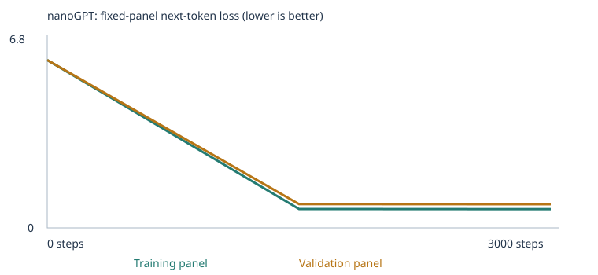

# Class 4: learning to train a tiny language model


The classroom model improved from **9/48 to 20/48** on the fixed four-choice tests. The fresh expanded model improved from **7/48 to 24/48**. Its added opposites and negation lessons did **not** produce a successful extension-test answer: two opposites cases became scorable but remained wrong, and all negation cases remained unscorable. The higher final total came from the familiar-word rephrasing tests. These are **public development tests**, not an unseen test of general understanding.


[Executed classroom notebook](custom_llm.ipynb) · [Executed expanded notebook](custom_llm_expanded.ipynb) · [Acceptance checks](evidence/current-acceptance.json) · [All 192 case results and continuations](docs/all-evals.md) · [Real terminal recording](evidence/current-chat/terminal.cast)


**Which results are current?** This README describes only the two runs in [experiments.json](experiments.json). Earlier experiments already existed in this repository and remain preserved. Their [prior report](https://github.com/tess-rubin/class-4-custom-llm/blob/a52ef411ee9f80ce50deb658039cdf7b645421a4/README.md) belongs to that earlier revision; its scores and corpus are not substituted for this session's results.


## Four complete result sets


| Experiment | Stage | All-case success | Scorable accuracy | Case coverage | Complete evidence |
| --- | --- | --- | --- | --- | --- |
| starter | untrained | 9/48 (18.75%) | 9/24 (37.50%) | 24/48 (50.00%) | [JSON](llm_runs/20260923T002935_286109Z/language_evals/untrained/eval_results.json) / [CSV](llm_runs/20260923T002935_286109Z/language_evals/untrained/eval_results.csv) / [summary](llm_runs/20260923T002935_286109Z/language_evals/untrained/eval_summary.json) |
| starter | final | 20/48 (41.67%) | 20/24 (83.33%) | 24/48 (50.00%) | [JSON](llm_runs/20260923T002935_286109Z/language_evals/final/eval_results.json) / [CSV](llm_runs/20260923T002935_286109Z/language_evals/final/eval_results.csv) / [summary](llm_runs/20260923T002935_286109Z/language_evals/final/eval_summary.json) |
| expanded | untrained | 7/48 (14.58%) | 7/26 (26.92%) | 26/48 (54.17%) | [JSON](llm_runs/20260923T012054_755149Z/language_evals/untrained/eval_results.json) / [CSV](llm_runs/20260923T012054_755149Z/language_evals/untrained/eval_results.csv) / [summary](llm_runs/20260923T012054_755149Z/language_evals/untrained/eval_summary.json) |
| expanded | final | 24/48 (50.00%) | 24/26 (92.31%) | 26/48 (54.17%) | [JSON](llm_runs/20260923T012054_755149Z/language_evals/final/eval_results.json) / [CSV](llm_runs/20260923T012054_755149Z/language_evals/final/eval_results.csv) / [summary](llm_runs/20260923T012054_755149Z/language_evals/final/eval_summary.json) |


**Four-choice scores:** the model receives only the prefix. The unchanged scorer
compares the probabilities of four possible next words, then checks its selection
against the answer key. The key and choices never enter the model input. Ties
receive zero. The four probabilities are entries from the full vocabulary, not
probabilities rescaled to sum to one across those four words.

**Free continuations:** a separate sampling step writes an unrestricted reply.
That reply does not determine the four-choice score. A correct choice can coexist
with a poor reply, and an empty reply is retained when the end token is sampled.

**Coverage:** a case is scorable only if every prompt word and every choice is in
the saved vocabulary and the prompt fits the context. Unscorable cases still
count as zero out of all 48. Scorable accuracy uses a smaller denominator. This
case-level coverage is different from the fraction of unknown individual tokens
in the training or validation text. Coverage does not change during a run because
training changes weights, not that run's fixed vocabulary.

## Choices and prediction, recorded before training

The user selected local CPU execution, **3,000 weight updates**, a configured
learning rate of **0.001**, and **opposites plus negation**. The
[pretraining prediction](experiment_plan.json) was that training loss would fall,
samples would become more corpus-like, validation loss might improve, and added
data might improve coverage and some scores while failures remained. The
prediction was supported for loss and familiar templates, but the targeted
extension tests did not show success.

A step is one batch update, not a whole pass through the corpus. The selected
budget and rate are the assignment's starting suggestions. Too large a rate can
cause unstable updates; too small a rate can make learning slow. The supplied
100-step warmup and cosine decay remain unchanged. The first actual rate is
0.00001, with a peak setting of 0.001 and decay toward one tenth of that setting.

Both runs use seed 42, CPU with up to four threads, two transformer blocks, four
attention heads, 64-number embeddings, 48-token context, batches of 32, no dropout,
and AdamW with its supplied clipping and regularization. The expanded model starts
fresh; it does not continue the starter's weights. Seeds/settings stay the same,
but a larger vocabulary changes tensor dimensions and IDs, so initial models are
not identical. Splits and loss panels stay fixed **within** each experiment.

## Teaching data and separation

The starter reads an empty `corpus/starter/` folder and uses the supplied classroom
generator. The expanded run reads only `corpus/expanded/`, adding exactly
[120 opposites passages](corpus/expanded/opposites.txt) and
[120 negation passages](corpus/expanded/negation.txt). They are newly composed,
AI-assisted, shareable text with invented people and ordinary situations, not
private records or copied third-party material. See the
[source choices and review](docs/corpus-design.md) and
[pretraining extraction audit](evidence/extension_pretraining_review.json).

Contextual contrasts could teach relationships such as heavy/light and noisy/quiet.
Negation examples distinguish rejected actions from what actually happens. Each
line is one sentence, with semicolons where needed to keep a correction together;
the supplied loader extracts exactly 240 unique passages, each at most 19 tokens.
There are no PDFs, OCR claims, or extraction warnings. This small addition does
not guarantee coverage of the particular words used in every public test.

The classroom reservation removes 160 generated passages containing exact test
prefixes before deduplication, the 90/10 split, or vocabulary construction. Imported
files and final passages also pass the supplied prefix guard. All teaching text
was additionally reviewed for copied test stories, close story paraphrases,
answer lists, and outputs; none were identified. Exact matching alone cannot
prove semantic separation, so both source files are public for inspection.

Evals, answer keys, reports, source notes, transcripts, and result folders stay
outside both corpus inputs. Vocabulary comes only from the training split. A
source file can contribute passages to both train and validation; this is not a
test on unseen source files. Classroom validation shares templates with training.


| Corpus | Unique passages | Train | Validation | Vocab incl. specials | Training types | Omitted train types | Train UNK | Validation UNK |
| --- | --- | --- | --- | --- | --- | --- | --- | --- |
| starter | 4592 | 4132 | 460 | 136 | 133 | 0 | 0.00% | 0.00% |
| expanded | 4832 | 4348 | 484 | 498 | 495 | 0 | 0.00% | 0.25% |

The expansion contributes **216 training passages and 24 validation passages**. The 495 expanded training token types all fit below the 509-type cap; its validation UNK rate comes from words absent from training. The 240 added passages are about 5% of all 4,832 unique passages. No vocabulary entries were inserted from eval text.


## Group and category breakdowns

Each entry is **correct / total (scorable)**. Every case remains in its denominator.


| Group | Starter untrained | Starter final | Expanded untrained | Expanded final |
| --- | --- | --- | --- | --- |
| extend_corpus | 0/24 (0) | 0/24 (0) | 0/24 (2) | 0/24 (2) |
| starter_patterns | 6/16 (16) | 16/16 (16) | 5/16 (16) | 16/16 (16) |
| starter_transfer | 3/8 (8) | 4/8 (8) | 2/8 (8) | 8/8 (8) |

| Category | Starter untrained | Starter final | Expanded untrained | Expanded final |
| --- | --- | --- | --- | --- |
| categories_and_analogies | 0/3 (0) | 0/3 (0) | 0/3 (0) | 0/3 (0) |
| domain_context | 3/8 (8) | 8/8 (8) | 3/8 (8) | 8/8 (8) |
| domain_place | 3/8 (8) | 8/8 (8) | 2/8 (8) | 8/8 (8) |
| everyday_knowledge | 0/3 (0) | 0/3 (0) | 0/3 (0) | 0/3 (0) |
| grammar | 0/3 (0) | 0/3 (0) | 0/3 (0) | 0/3 (0) |
| negation | 0/3 (0) | 0/3 (0) | 0/3 (0) | 0/3 (0) |
| new_wording | 3/8 (8) | 4/8 (8) | 2/8 (8) | 8/8 (8) |
| opposites | 0/3 (0) | 0/3 (0) | 0/3 (2) | 0/3 (2) |
| reference | 0/3 (0) | 0/3 (0) | 0/3 (0) | 0/3 (0) |
| sequence | 0/3 (0) | 0/3 (0) | 0/3 (0) | 0/3 (0) |
| spatial_relations | 0/3 (0) | 0/3 (0) | 0/3 (0) | 0/3 (0) |


The four additional final successes are rephrasing cases that were already
scorable in the starter. Their score improvement is therefore not just a change
in vocabulary coverage. However, the changed corpus also changes the split and
initialization dimensions, so one seed does not isolate a causal effect of the
new teaching patterns.

The two newly scorable opposites cases remain wrong: `lang_28` selects **heavy**
instead of **cold**, and `lang_29` selects **early** instead of **full**. This is
coverage improvement without successful answer selection. The third opposites
case still lacks the distractor `round`. All three negation cases remain
unscorable: the teaching material does not supply all their color, purchase, or
door-state words. More training on the unchanged vocabulary could not fix those
missing words. We preserve these failures rather than tuning the corpus after
seeing them or claiming successful negation learning.

### Actual continuations, including failures


| Model | Case | Prompt | Choice | Expected | Actual free continuation |
| --- | --- | --- | --- | --- | --- |
| starter | lang_18 | yesterday the school discussed the educator and the | harvest | student | local lecturer . |
| starter | lang_28 | the opposite of hot is | unscorable | cold | [empty response] |
| expanded | lang_18 | yesterday the school discussed the educator and the | student | student | learning . |
| expanded | lang_21 | the station report compared the bus and the | route | route | taxi was in the truck . |
| expanded | lang_28 | the opposite of hot is | heavy | cold | product rather than at the kitchen . |
| expanded | lang_29 | the opposite of empty is | early | full | no shout and read the could worker to the room . |
| expanded | lang_31 | the box is not red . it is blue . the box is | unscorable | blue | . |
| expanded | lang_33 | the door is not open . it is closed . the door is | unscorable | closed | bicycle . |

For example, the expanded bus case gets the choice `route` right but freely continues with “taxi was in the truck .” A four-choice success is a narrow measurement, not evidence of a good unrestricted response. [Every prompt, status, missing word, score, and continuation](docs/all-evals.md) is retained.


## Losses and every saved sample

These are **fixed panels of 20 training and 20 validation documents** per run, averaging non-padding next-token targets, including EOS. They are small estimates, not full-corpus losses. Different corpora and vocabularies make raw loss values unsuitable for ranking the two models. The expanded training panel contains zero extension passages and its validation panel contains only one, so the curves are weak evidence about the added skills.


### Starter


| Step | Training panel loss | Validation panel loss |
| --- | --- | --- |
| 0 | 4.926252365112305 | 4.927547931671143 |
| 1500 | 0.6821381449699402 | 0.7182430624961853 |
| 3000 | 0.6783124208450317 | 0.7061358690261841 |

Full measured table: [history.json](llm_runs/20260923T002935_286109Z/history.json), [training.csv](llm_runs/20260923T002935_286109Z/training.csv).


**Step 0** — [full saved file](llm_runs/20260923T002935_286109Z/samples/step_0000.txt)

```text
pear professor bond doctor course harvest team physician journey checking buyer delivery traffic report the lecturer item offering and system <UNK> taste recommended mentioned bus question customer at mortgage nurse in instructor
kitchen purchase journey product question discussion journey service . nurse local
compared and purchase update mortgage question loan taste in market treatment learned another item bicycle product bicycle focused data and dentist recommended mango apple taxi bicycle delivery peach quality update student lesson
important hospital juice patient return recommended deposit tutor returned understand kitchen student design ordered hospital treatment important package traffic with yesterday investment important of mentioned store ordered mortgage nurse shopper the station
```


**Step 1500** — [full saved file](llm_runs/20260923T002935_286109Z/samples/step_1500.txt)

```text
our school has a question about the new educator and lesson .
a review of risk helped us understand the different deposit .
we learned about the important website during a discussion of data .
our school has a question about the different instructor and course .
```


**Step 3000** — [full saved file](llm_runs/20260923T002935_286109Z/samples/step_3000.txt)

```text
our school has a question about the new educator and lesson .
a review of risk helped us understand the different deposit .
the report about the nurse explains the health in detail .
the consumer compared the offering after checking the price .
```


### Expanded




| Step | Training panel loss | Validation panel loss |
| --- | --- | --- |
| 0 | 6.202173709869385 | 6.202082633972168 |
| 1500 | 0.6975792646408081 | 0.8760055303573608 |
| 3000 | 0.6922186017036438 | 0.8706271648406982 |

Full measured table: [history.json](llm_runs/20260923T012054_755149Z/history.json), [training.csv](llm_runs/20260923T012054_755149Z/training.csv).


**Step 0** — [full saved file](llm_runs/20260923T012054_755149Z/samples/step_0000.txt)

```text
client lift slow ate walk where correct information time serving merchandise piece shopper out feel towels working installing train compare kept towel visitors placed result using piece when dry late change page
than software truck purchase package none silence explain result plate . car aloud morning unchanged so received into dry towels screen discussed hot spilled cross stayed down paper coat chair <BOS> made
blanket unchanged carried blanket item cloth out copy high same ordered stone were still car request lift nurse travel reply put names side washed incomplete people next bed finish system saved everyone
low names where walk plate than their afternoon website first banana asked show ate writing compare physician chair ended moving teacher same last across feel view wall afternoon covered drew of date
```


**Step 1500** — [full saved file](llm_runs/20260923T012054_755149Z/samples/step_1500.txt)

```text
our hospital has a question about the local therapist and health .
a review of support helped us understand the important subscriber .
today the school focused on lesson and the important tutor .
our station has a question about the important car and route .
```


**Step 3000** — [full saved file](llm_runs/20260923T012054_755149Z/samples/step_3000.txt)

```text
our hospital has a question about the local surgeon and health .
a review of treatment helped us understand the important physician .
we learned about the important offering during a discussion of quality .
a review of delivery helped us understand the important item .
```


Both runs change from unstructured word sequences to familiar classroom templates by step 1,500. Some starter samples are unchanged at step 3,000; additional steps do not require every seeded sample to change. These plausible templates coexist with the extension failures above.


## How learning works, using this run

This is an **assisted explanatory draft**. The student selected settings and categories; Codex helped execute, inspect, and explain the experiments. It is not a claim that the student independently wrote the teaching corpus or has already explained every concept. [Plain-language study guide](docs/learning-guide.md).


A **corpus** is the collection of practice sentences. This model splits words and punctuation into **tokens**. The token `customer` has **ID 28**, an arbitrary lookup number, not an amount of meaning. Its **embedding** is the row of 64 learned numbers selected by that ID. The network combines these numbers using learned weights to predict the next token.


[Tokenization and IDs](llm_runs/20260923T002935_286109Z/tokenization.json) · [Actual inspection](llm_runs/20260923T002935_286109Z/inspection.json)


<details>
<summary>All 64 customer embedding coordinates before training</summary>

```json
[
  -0.057591915130615234, -0.004809952806681395, 0.04263188689947128, 0.019338956102728844,
  0.015643112361431122, -0.02882436476647854, 0.025609055534005165, 5.24539100297261e-05,
  0.02470681630074978, 0.0206917654722929, 0.0073690167628228664, -0.033089615404605865,
  -0.05354786664247513, -0.0057429298758506775, -0.024166762828826904, -0.014716118574142456,
  0.004685705993324518, -0.01045426819473505, -0.008381076157093048, -0.018258560448884964,
  -0.020133700221776962, 0.005098641850054264, -0.010916502214968204, -0.012633351609110832,
  0.028389625251293182, -0.002631223062053323, -0.004071926232427359, 0.013641919940710068,
  -0.009891724213957787, -0.01671762578189373, 0.0019060791237279773, -0.001453503966331482,
  0.01602652296423912, -0.005674875341355801, -0.0006723481928929687, -0.001290727173909545,
  -0.0073194727301597595, -0.0009307070868089795, 0.0015076251002028584, -0.004976638592779636,
  -0.028987018391489983, 0.018092988058924675, -0.007348013576120138, -0.005440254230052233,
  0.01564120315015316, -0.004543505609035492, 0.04156793653964996, 0.052355434745550156,
  0.02264268510043621, -0.015414278022944927, -0.025121202692389488, -0.006797463167458773,
  0.02935275062918663, -0.0025336795952171087, 0.029801227152347565, -0.022797001525759697,
  -0.03023790940642357, 0.006436787545681, 0.050490811467170715, 0.007490998134016991,
  -0.01072286069393158, 0.02473733201622963, -0.014468739740550518, 0.013235915452241898
]
```

</details>


<details>
<summary>All 64 customer embedding coordinates after training</summary>

```json
[
  0.0366341732442379, -0.018220536410808563, 0.13303034007549286, 0.10594939440488815,
  0.06301453709602356, 0.018911829218268394, 0.1523018777370453, 0.09291001409292221,
  -0.06321704387664795, -0.017258010804653168, 0.03409397974610329, -0.047387171536684036,
  -0.06455785036087036, -0.0865875706076622, -0.14499273896217346, -0.035883259028196335,
  -0.15690916776657104, -0.15027035772800446, -0.007621560711413622, -0.0707453191280365,
  -0.09301508218050003, 0.009108588099479675, -0.06480909138917923, 0.017520923167467117,
  0.003925257828086615, -0.062455806881189346, 0.11252003163099289, -0.06432439386844635,
  0.05204556882381439, -0.15667380392551422, -0.07061778008937836, 0.06167834624648094,
  -0.03176841512322426, 0.14139649271965027, 0.09131014347076416, 0.05647144466638565,
  0.019607752561569214, -0.1348353922367096, 0.12228579819202423, -0.033833492547273636,
  0.11873938888311386, 0.004578718915581703, -0.1344321370124817, 0.05294344946742058,
  -0.03759889677166939, -0.10312117636203766, 0.020276745781302452, 0.03811298683285713,
  -0.019842343404889107, -0.15073718130588531, 0.030281826853752136, -0.12055547535419464,
  0.016618287190794945, 0.07775542140007019, 0.11808761954307556, 0.05573713034391403,
  0.09336275607347488, 0.0026290928944945335, 0.03705647960305214, 0.07563263177871704,
  0.11851766705513, 0.014375245198607445, 0.09128886461257935, -0.0746087059378624
]
```

</details>


For the same prefix **“the customer”**, these are next-token probabilities before sampling temperature is applied:


| Possible next token | Before training | After training |
| --- | --- | --- |
| customer | 1.60% | 0.01% |
| reviewed | 0.71% | 17.82% |
| recommended | 0.64% | 17.12% |
| ordered | 0.62% | 16.85% |
| selected | 0.78% | 16.34% |
| compared | 0.62% | 15.97% |

The trained model assigns probability to purchase-related verbs because those continuations recur in the teaching text. A probability is a model estimate, not a truth score. Sampling chooses a token from the resulting distribution, appends it to the context, and repeats until EOS or the output limit.


| First update of customer coordinate 0 | Measured value |
| --- | --- |
| Before | -0.057591915130615234 |
| Recorded gradient (before clipping) | 0.000692586530931294 |
| Actual warmup learning rate | 1e-05 |
| After | -0.05760190635919571 |
| Change: after − before | -9.991228580474854e-06 |

**Loss** measures how poorly the predicted probabilities match the actual next tokens in the practice sentences. Backpropagation computes **gradients**, which describe how changes to weights affect loss locally. AdamW uses those gradients to make **weight updates**. Repeating this process changes later predictions. The recorded gradient is before norm clipping; AdamW also uses adaptive scaling, momentum and weight decay. The measured change therefore is not simply minus the displayed gradient times the configured 0.001. The first small update is different from the total change across 3,000 steps.

**Attention** lets each position combine information from earlier tokens; the causal mask prevents looking at future answers. Learned token and position embeddings, attention blocks, and other weights work together. The saved attention rows show one head, not a full explanation of a decision.


| Run | Stage | Three cosine neighbors of customer in full 64D |
| --- | --- | --- |
| starter | before | bus (0.2133), educator (0.2033), helped (0.2022) |
| starter | after | shopper (0.9781), client (0.9769), buyer (0.9766) |
| expanded | before | bicycle (0.3860), dirt (0.3766), continued (0.3235) |
| expanded | after | client (0.9704), buyer (0.9684), subscriber (0.9621) |

The trained neighbors share classroom contexts; this supports a narrow distributional pattern, not broad word understanding. Open [embedding-viewer.html](embedding-viewer.html) locally and load a run's `checkpoint.json` to inspect the vectors. The 3D PCA projection compresses 64 dimensions; it can distort apparent distances. Cosine neighbors above use all 64.


## Temperature changes sampling, not weights

The comparisons use temperatures **0.3, 0.8, 1.2**, the same BOS starting token, and sampling seed 2026. Lower temperature concentrates probabilities; higher temperature spreads them out. Neither retrains the network. The baseline sample timeline also uses temperature 0.8 and seed 2026, with four samples of up to 32 new tokens. Eval/chat generation instead uses a prefix, up to 24 new tokens, per-case/turn seeds, and masks generated BOS. These two supplied generators are preserved.


Starter: [complete temperature data](llm_runs/20260923T002935_286109Z/temperature_comparison.json).


Expanded: [complete temperature data](llm_runs/20260923T012054_755149Z/temperature_comparison.json).


| Run | Temperature | First actual sample |
| --- | --- | --- |
| starter | 0.3 | our school has a question about the new educator and lesson . |
| starter | 0.8 | our school has a question about the new educator and lesson . |
| starter | 1.2 | our school has a question about the new educator and lesson . |
| expanded | 0.3 | the team discussed the mango and the taste at the kitchen . |
| expanded | 0.8 | our hospital has a question about the local surgeon and health . |
| expanded | 1.2 | lesson rather than ate noisy market because the time was merchandise . |

The expanded 1.2 sample becomes garbled, while its lower-temperature samples follow classroom patterns. The starter's complete 0.8 and 1.2 sample sets happen to be identical for this seed; higher temperature does not guarantee different text on each draw. [All temperature samples](docs/temperature-samples.md).


## Working chat and real interaction evidence

The unchanged [chat.py](chat.py) loads the expanded run's full `model.pt` and vocabulary. It is a tiny continuation model, not an instruction-trained assistant. Every prompt starts fresh, with a 48-token context. It reports unknown words and truncation; it does not update weights or put chats into the corpus.


Run: `llm_runs/20260923T012054_755149Z`. Model-state SHA-256: `cb6dde986cf6f15df7a8bb585a984e1fd9ddec03e0a2a63f87ff89cfb82d6250`.


| Purpose | Actual prompt | Actual reply | Unknown prompt words | Seed |
| --- | --- | --- | --- | --- |
| Familiar | the customer | selected the brand after checking the price . | none | 2026 |
| Extension-related | at the station the gate is not closed but | offering rather than sold . | closed, gate | 2027 |
| Limitation | explain quantum teleportation | the student early apple , while the full page left . | quantum, teleportation | 2028 |

The familiar prompt yields a purchase-template continuation. The extension prompt contains unknown `gate` and `closed` and produces an incoherent response. The quantum prompt contains two unknown words and receives irrelevant classroom text. None of these replies is replaced by a canned answer.

[Native transcript](evidence/current-chat/transcript.json) · [Actual terminal output](evidence/current-chat/terminal.txt) · [Asciinema v2 recording](evidence/current-chat/terminal.cast) · [Offline playback page](evidence/current-chat/playback.html) · [Recording verification](evidence/current-chat/verification.json)

The recording captures real PTY output and echoed input with timestamps. The helper enters three prompts into the running interface; it does not construct replies. To watch, download/open `playback.html` in a browser and press Play. It is self-contained and needs no network. The `.cast` is also usable in an asciinema player. This is a recording, not a simulated screenshot. It is stored separately from the notebook's complete results ZIP.


## Runtime and complete artifact links

Measured locally on `macOS-26.6.2-arm64-arm-64bit-Mach-O`, Python 3.13.15, PyTorch 2.14.0, NumPy 2.5.3. CPU was explicitly selected; no pretrained weights or external model API were used. Training times below include milestone panel/sample checks, but exclude separate before/after language eval cells. They are measurements of these runs, not a runtime guarantee for another machine.


| Run | Completed steps | Parameters | Training-loop seconds | Interrupted |
| --- | --- | --- | --- | --- |
| starter | 3000 | 111872 | 7.285974666010588 | False |
| expanded | 3000 | 135040 | 8.397052374988561 | False |

The [separate 10-step setup notebook](evidence/setup/custom_llm_10_steps.ipynb) completed before either main run and is not included in the four-row results. A first setup attempt could not start its kernel inside the sandbox; no cells trained in that attempt. The successful rerun used local loopback kernel access. [Setup test log](evidence/setup/tests.txt) records all 14 supplied tests passing.


**Starter:** [executed notebook](custom_llm.ipynb) · [complete run folder](llm_runs/20260923T002935_286109Z) · [complete ZIP](llm_runs/20260923T002935_286109Z.zip) · [config](llm_runs/20260923T002935_286109Z/config.json) · [training summary](llm_runs/20260923T002935_286109Z/training_summary.json) · [loss CSV](llm_runs/20260923T002935_286109Z/training.csv) · [loss JSON](llm_runs/20260923T002935_286109Z/history.json) · [tokens and IDs](llm_runs/20260923T002935_286109Z/tokenization.json) · [vectors, probabilities and update](llm_runs/20260923T002935_286109Z/inspection.json) · [temperatures](llm_runs/20260923T002935_286109Z/temperature_comparison.json) · [corpus manifest](llm_runs/20260923T002935_286109Z/corpus_manifest.json) · [vocabulary](llm_runs/20260923T002935_286109Z/vocabulary_report.json) · [split and panels](llm_runs/20260923T002935_286109Z/split.json) · [separation](llm_runs/20260923T002935_286109Z/eval_separation.json) · [training-source text before split](llm_runs/20260923T002935_286109Z/corpus.txt) · [trained weights](llm_runs/20260923T002935_286109Z/model.pt) · [untrained weights](llm_runs/20260923T002935_286109Z/model_untrained.pt) · [viewer embeddings](llm_runs/20260923T002935_286109Z/checkpoint.json)


**Expanded:** [executed notebook](custom_llm_expanded.ipynb) · [complete run folder](llm_runs/20260923T012054_755149Z) · [complete ZIP](llm_runs/20260923T012054_755149Z.zip) · [config](llm_runs/20260923T012054_755149Z/config.json) · [training summary](llm_runs/20260923T012054_755149Z/training_summary.json) · [loss CSV](llm_runs/20260923T012054_755149Z/training.csv) · [loss JSON](llm_runs/20260923T012054_755149Z/history.json) · [tokens and IDs](llm_runs/20260923T012054_755149Z/tokenization.json) · [vectors, probabilities and update](llm_runs/20260923T012054_755149Z/inspection.json) · [temperatures](llm_runs/20260923T012054_755149Z/temperature_comparison.json) · [corpus manifest](llm_runs/20260923T012054_755149Z/corpus_manifest.json) · [vocabulary](llm_runs/20260923T012054_755149Z/vocabulary_report.json) · [split and panels](llm_runs/20260923T012054_755149Z/split.json) · [separation](llm_runs/20260923T012054_755149Z/eval_separation.json) · [training-source text before split](llm_runs/20260923T012054_755149Z/corpus.txt) · [trained weights](llm_runs/20260923T012054_755149Z/model.pt) · [untrained weights](llm_runs/20260923T012054_755149Z/model_untrained.pt) · [viewer embeddings](llm_runs/20260923T012054_755149Z/checkpoint.json)


The ZIPs and executed notebooks are separate files; both complete ZIPs are retained locally and published. `checkpoint.json` is for the embedding viewer; `model.pt` is the inference network. Neither contains all optimizer/random state for exact training resume. Notebook FileLink outputs retain real local paths; use this README's repository links when browsing on GitHub.


## Reproduce the notebook, evaluation and chat

Run from the repository root. The input notebooks differ from the preserved upstream notebook only in experiment settings and the recorded prediction. The runner explicitly uses the current Python interpreter for its kernel, saves real outputs after each cell, and rejects an existing output notebook. Each training run also creates a new timestamped run folder and ZIP.

```sh
python3 -m venv .venv
.venv/bin/python -m pip install -r requirements-local.txt
.venv/bin/python -m unittest test_language_evals test_corpus
.venv/bin/python scripts/execute_notebook.py notebooks/setup.ipynb --output results/new-setup.ipynb
.venv/bin/python scripts/execute_notebook.py notebooks/starter.ipynb --output results/new-starter.ipynb
.venv/bin/python scripts/execute_notebook.py notebooks/expanded.ipynb --output results/new-expanded.ipynb
```

The [complete environment lock](requirements-lock.txt) records the exact installed versions. `requirements-local.txt` adds NumPy because the supplied scorer uses `tensor.numpy()`, plus notebook execution tooling. The original requirements remain intact.


```sh
.venv/bin/python run_evals.py --model llm_runs/20260923T002935_286109Z/model_untrained.pt --stage untrained --output results/new-starter-untrained
.venv/bin/python run_evals.py --model llm_runs/20260923T002935_286109Z/model.pt --stage final --output results/new-starter-final
.venv/bin/python run_evals.py --model llm_runs/20260923T012054_755149Z/model_untrained.pt --stage untrained --output results/new-expanded-untrained
.venv/bin/python run_evals.py --model llm_runs/20260923T012054_755149Z/model.pt --stage final --output results/new-expanded-final
.venv/bin/python chat.py --model llm_runs/20260923T012054_755149Z/model.pt --transcript results/my-chat.json
```


Enter a prompt and press Enter; `/quit` saves the transcript and exits. Use a new transcript filename and new evaluation output directories. All four saved-model commands were exercised in [separate rerun folders](evidence/current-reruns/); every saved case, probability, score and continuation exactly matches its original notebook result. [Rerun verification](evidence/current-reruns/verification.json).


```sh
.venv/bin/python scripts/verify_artifacts.py --starter-run llm_runs/20260923T002935_286109Z --expanded-run llm_runs/20260923T012054_755149Z --starter-notebook custom_llm.ipynb --expanded-notebook custom_llm_expanded.ipynb --starter-rerun evidence/current-reruns/starter/final --expanded-rerun evidence/current-reruns/expanded/final
```


This verifier confirms all 192 case records, CSV/JSON consistency, untouched fixed sources, the seeded training-only vocabularies and splits, saved initial and trained models, both executed notebooks, and complete ZIP contents. The [source provenance](provenance.json) identifies starter revision `9e04ddb6aacb8efcb790e70c62550ca55e0f2a75` and the pinned nanoGPT revision `3adf61e154c3fe3fca428ad6bc3818b27a3b8291`. [Original README](STARTER_README.md) · [nanoGPT license](NANOGPT_LICENSE) · [Unchanged 48-case suite](evals/language_evals.json) · [Unchanged runner](run_evals.py).


## Limitation and next experiment

The model learns repeated classroom patterns much better than unfamiliar tasks. More known words do not guarantee correct relationships, as both newly scorable opposites failures demonstrate. The tiny loss panels mostly represent the original classroom text. One seed and changing splits/vocabularies limit causal conclusions.

A next experiment would add a more substantial, independently written set of varied relational and negation lessons, inspect vocabulary coverage from training material, and evaluate the added skills with balanced panels and multiple seeds. Keep these public tests as development tests and create an additional untouched holdout before further tuning. More steps alone cannot add missing vocabulary. No minimum score is required; completeness and honest interpretation matter more than reporting only successes.
